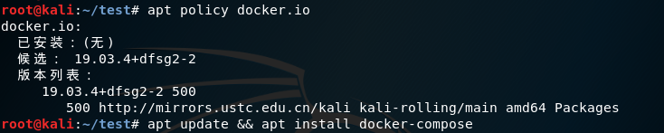
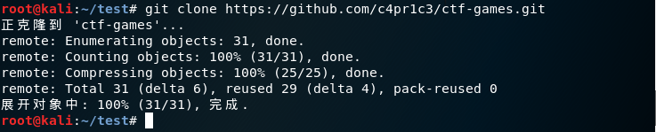
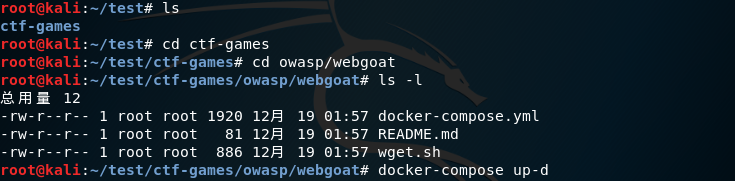
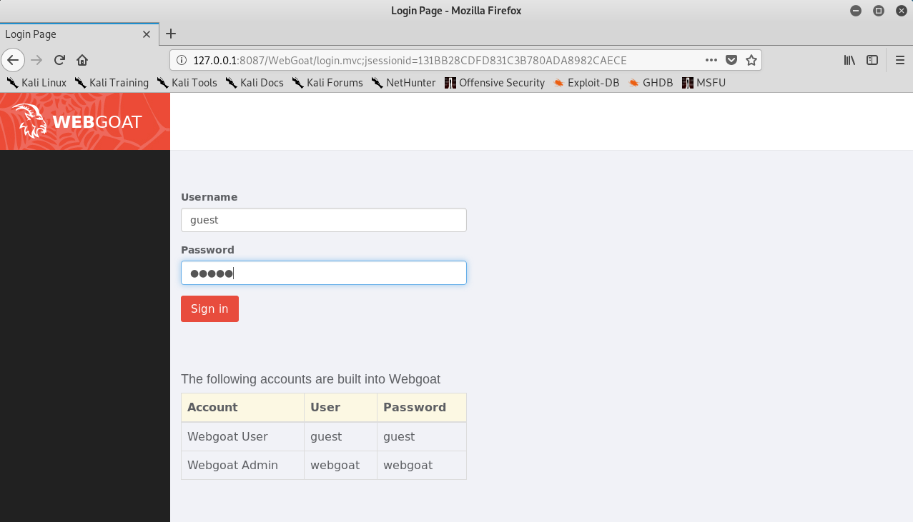
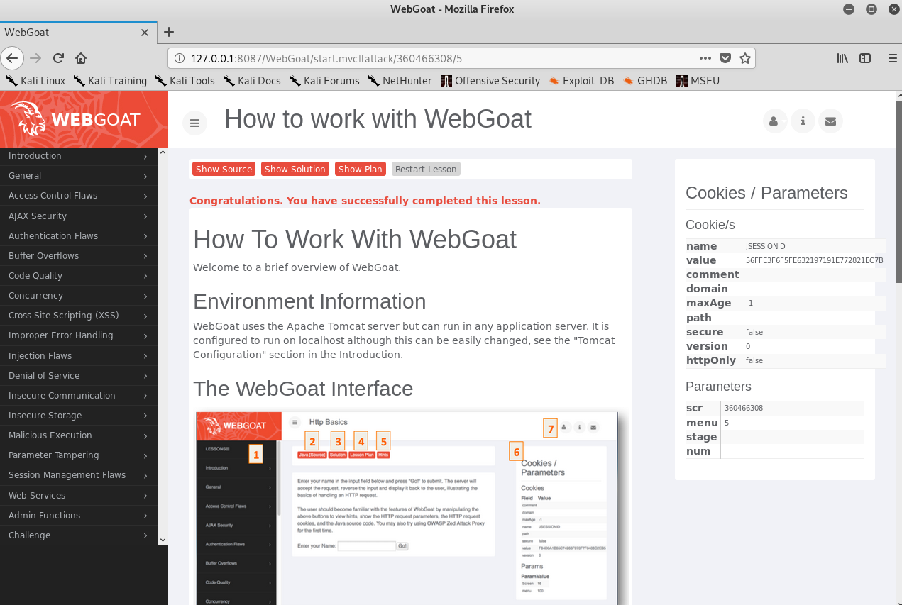
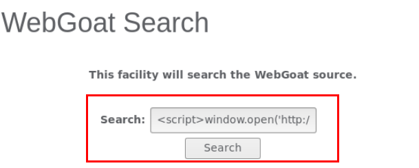
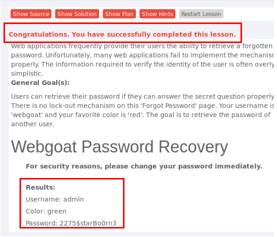
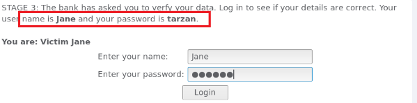
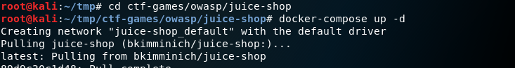
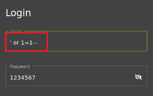

# Web 应用漏洞攻防 #

## 实验目的 ##
- 了解常见 Web 漏洞训练平台；
- 了解 常见 Web 漏洞的基本原理；
- 掌握 OWASP Top 10 及常见 Web 高危漏洞的漏洞检测、漏洞利用和漏洞修复方法；

## 实验环境 ##
- WebGoat
- Juice Shop

## 实验要求 ##
- 每个实验环境完成不少于 5 种不同漏洞类型的漏洞利用练习

## 实验过程 ##
### 一、webgoat环境下的漏洞攻防 ###
### WebGoat环境搭建 ###
- 更新apt并安装docker-compose
  
  
- 将老师写好的文件git clone到该目录下
  
- 安装docker-compose
  
- 安装结束后利用命令docker ps查看，若容器都显示healthy，则表示安装成功
  
- 打开浏览器输入127.0.0.1:8087/WebGoat/attack进入登陆页面
  
  输入用户名密码即可登陆
  
- 下载SwitchyOmega插件，设置代理，命名为burpsuite。因为我们只用一台虚拟机，是自己访问自己的容器环境的方式，所以注意要将Bypass List中的内容删除，否则在burpsuite中无法看到我们的请求。
  
- 设置burpsuite的intercept is on，即相当于设置断点，方便调试、转发
  

### 未验证的用户输入漏洞 ###
### 绕过html字段限制 ###
- burpsuite设置为intercept is on,回到我们将要提交数据的界面，点击submit,可以看到burpsuite拦截到了我们提交的信息。
  
- 在burpsuite中对拦截到的信息的字段进行修改，并且点击forward将其提交上去，成功实现了绕过html字段的限制。
  
  

### XSS跨站脚本攻击 ###
- 实验目的：
 - 通过xss攻击获取受害者的cookie
 - 把cookie以参数的形式发送到目标服务器中

- 输入以下代码弹出页面cookie值
  
  
- 此时弹出了一个网页，其URL为
http://127.0.0.1:8087/WebGoat/catcherPROPERTY=yes&msg=JSESSIONID=4DC9F3FCD8CD3215786AE469A89699F9
此url中msg参数和之前弹窗弹出来的cookie相同，实验成功
  
  

### 脆弱访问控制 ###
- 原理：Web应用提供给用户密码找回功能，但是证明自己是该用户的方式过于简单，会造成威胁。
- 实验目的：通过类似穷举的方式突破身份证明问题，从而获取用户名密码
  
  
  
- 以admin用户为例，试着猜测密码保护问题的答案，以获取admin的密码。在user name处输入admin，提交后出现密码保护问题，任意输入各种颜色的名称，多次尝试后发现green为正确答案。出现提示后，表示攻击成功，得到了密码。
  

### 脆弱认证和会话管理 ###
- 原理：服务器通过每个用户的唯一的Session ID 来确认其合法性。如果用户已登录，并且授权他不必重新验证授权时，当他重新登录应用系统时，他的Session ID 依然是被认为合法的。
  
- 在邮件正文的链接中中加入Session ID。
  
- 点击提交后我是收件人Jane。点击弹出页面中的链接“Goat Hills Financial”。
  
- 以用户名Jane，密码tarzan登陆。
  
- 登陆成功。
  
- 现在我是黑客Joe,点击链接登录到“Goat Hills Financial”页面。我们可以看到浏览器网址中我们的SID是“NOVALIDSESSION” 。
  
- 将SID修改为最开始的邮件中填入的“WHATEVER”，实验成功 。
  

### 注入缺陷 ###
- 初始登陆界面
  
- 用Burp suite拦截提交，修改password内容为 ' or '1'='1。
  
- 实现绕过密码登陆。
  
  

### 二、Juice Shop环境下的漏洞攻防 ###
### Juice shop环境搭建 ###
- 切换到juiceshop目录下，输入docker-compose up -d进行安装。
  
- 利用命令docker ps查看，容器状态都显示healthy，表示安装成功。
  
- 访问入口地址，进入JuiceShop环境界面。
  
- 在源代码中搜索查找计分板。
  
- 访问对应网址，寻找计分板成功。
  

### sql注入缺陷 ###
- 按照之前WebGoat实验的sql原理，首先尝试email用 ' or '1'='1,密码随便填，发现无法登陆。
  
- 在用户名部分输入'or 1=1--，密码随意填写，尝试成功。
  
- 成功实现绕过密码登陆
  

### 脆弱认证 ###
- 实验目的：通过忘记密码，更改用户密码。
- 输入Bjoern的owasp账户，密保问题是问最喜欢的宠物。
  
- 通过互联网信息搜索，发现他有一只猫叫'Zaya'，尝试填入答案，并进行密码重置，成功实现密码重置。
  

### 敏感数据曝光/遗忘信息 ###
- 实验目的：Forgotten Sales Backup。
- 在/#/about 页面中通过开发者工具找到【使用条款】的对应href=“/ftp/legal.md”。
  
- 根据左下角的路径访问ftp链接。
  
  
- 点开文件可以看到机密文件内容，实现了获取。
  
  

### 脆弱访问控制 ###
- 实验目的：查看另一个用户的购物车。
- burpsuite设置为intercept is on，然后点击我的购物车，在burpsuite中可以看到我们抓到的包,第一行为GET /rest/basket/5 HTTP/1.1。
  
- 将basket后的5改为6，点击forward
  
- 实验成功
  

## 心得与感悟 ##
- 遇到的困难与解决方法：
 - 用指令docker-compose up -d安装WebGoat环境时因卡住而中途终止了安装，结果重新安装时失败，提示“Couldnot connect to Docker daemon”云云，上网查资料无法解决，又考虑到实验才刚开始，于是删除虚拟机，重新建立虚拟机进行实验，最终成功。
 - 用指令docker-compose up -d安装Juice shop环境时遇见存储空间不够，清理了一些文件后成功。这是用虚拟机做实验以来第一次遇见空间不足，也算是积累了一定经验。
   

- 收获:经过此次实验，我了解常见 Web 漏洞训练平台，了解 常见 Web 漏洞的基本原理，掌握了常见 Web 高危漏洞的漏洞检测、漏洞利用和漏洞修复方法。此外，我进一步加深了虚拟机的运用（源、网络、内存、ip、端口等）。