# 基于 VirtualBox 的网络攻防基础环境搭建 #

----------

## 实验目的 ##
- 掌握 VirtualBox 虚拟机的安装与使用
- 掌握 VirtualBox 的虚拟网络类型和按需配置
- 掌握 VirtualBox 的虚拟硬盘多重加载
## 实验环境 ##
- VirtualBox 虚拟机
- 攻击者主机（Attacker）：Kali Rolling 2109.2
- 网关（Gateway, GW）：Debian Buster
- 靶机（Victim）：From Sqli to shell / xp-sp3 / Kali
## 实验要求 ##
- [ √ ] 靶机可以直接访问攻击者主机
- [ √ ] 攻击者主机无法直接访问靶机
- [ √ ] 网关可以直接访问攻击者主机和靶机
- [ √ ] 靶机的所有对外上下行流量必须经过网关
- [ √ ]所有节点均可以访问互联网
## 实验过程 ##
- 配置虚拟硬盘为多重加载

- 创建四个虚拟机，分别为Attacker，gateway,Victim,Victim2
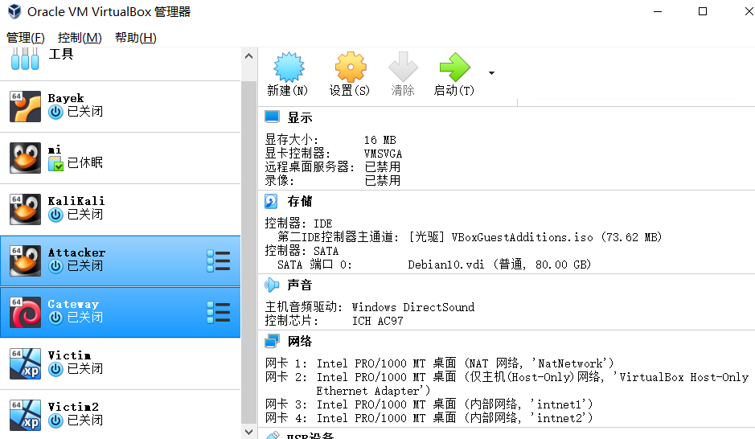
- 为虚拟机配置网卡
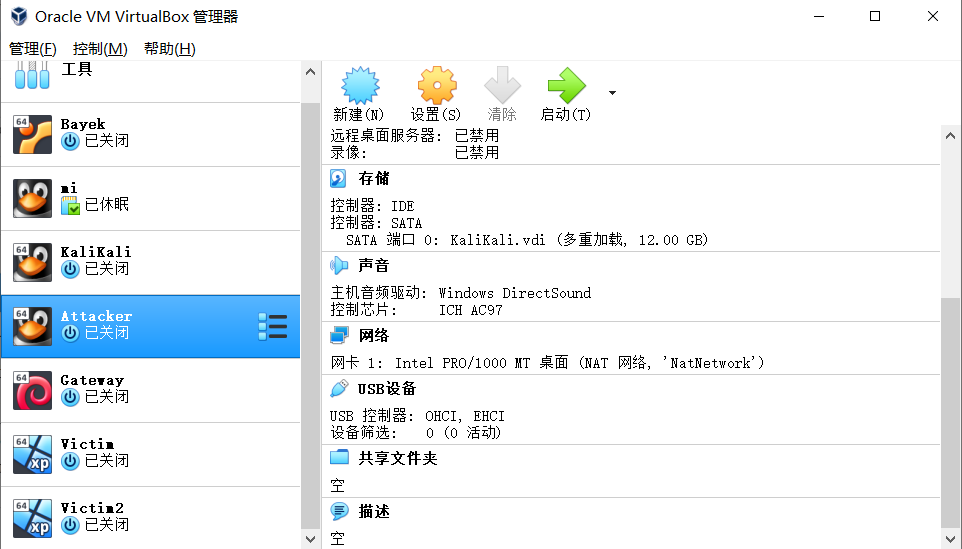
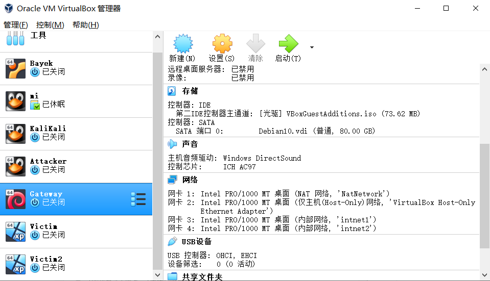
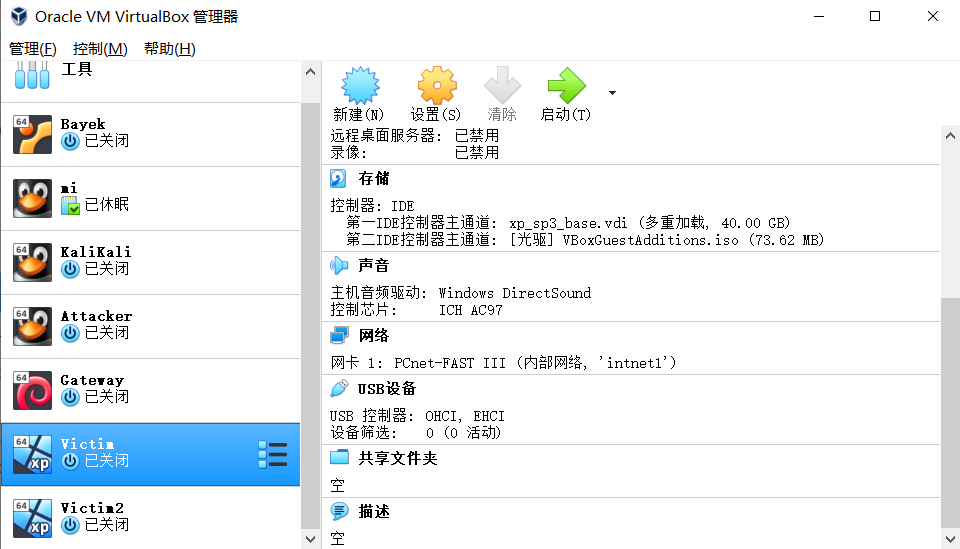
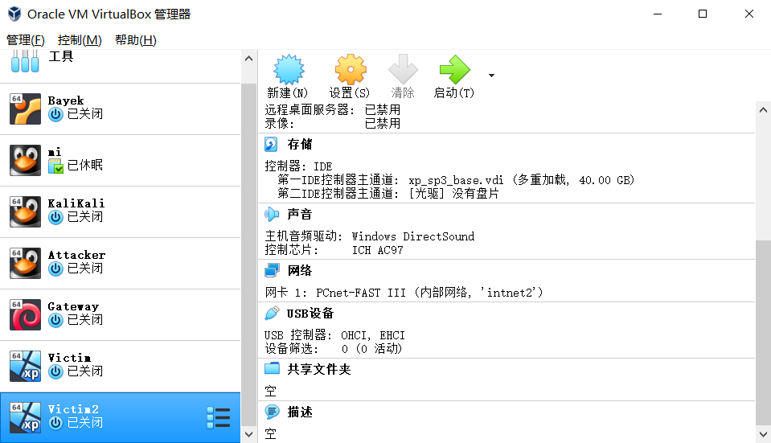
- Attacker（Kali，网卡1：NAT网络）
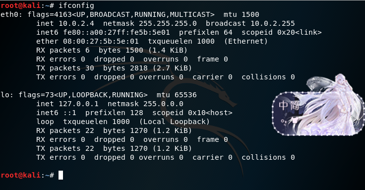
- gateway（debian，网卡1：NAT网络，网卡2：仅主机，网卡3：内部网络，网卡4：内部网络）
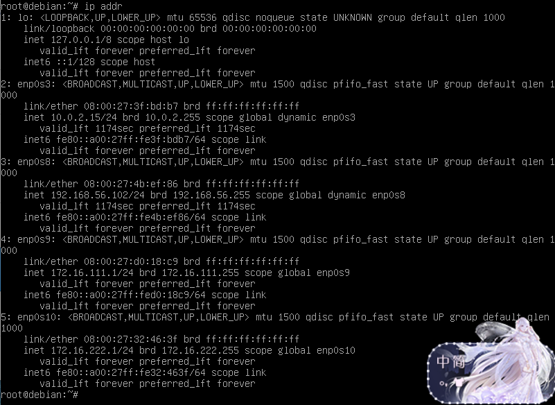
- victim（xp-sp3，网卡1：内部网络intnet1）
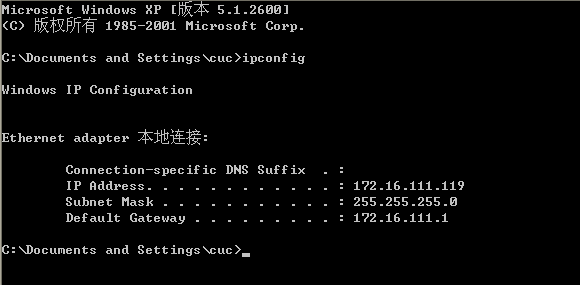
- victim2（xp-sp3，网卡1：内部网络intnet2）
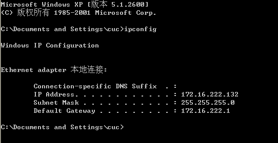
## 网络连通性 ##
- 靶机（Victim，Victim2）可以直接访问攻击者主机
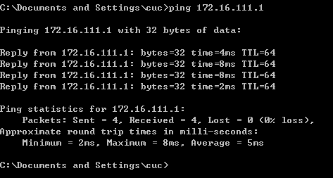
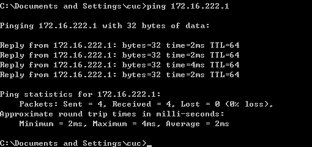
- 网关可以直接访问攻击者主机和靶机
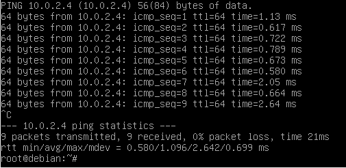
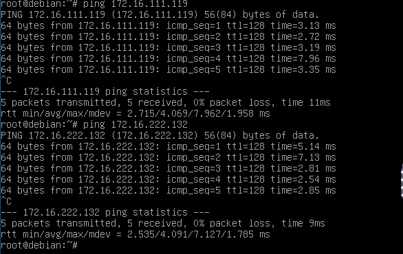
- 攻击者主机无法直接访问靶机
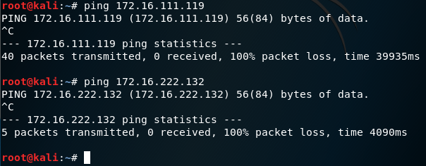
- 靶机的所有对外上下行流量必须经过网关
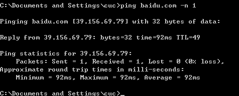
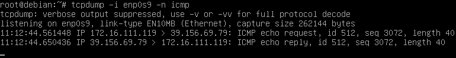
- 所有节点均可以访问互联网
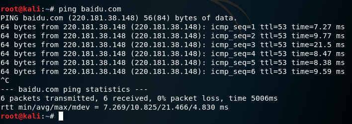
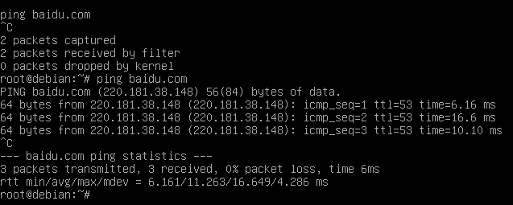
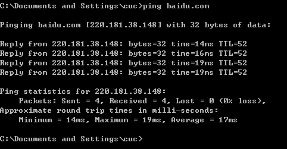
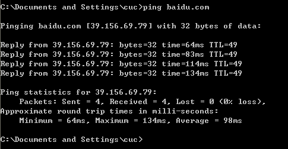
## 问题总结 ##
- 网关网卡设置不对（少了“仅主机”），导致无法获取ip。解决方法：在NAT网卡后增加网卡“host-only”。
- 靶机IP为169开头的IP地址，且缺少默认网关。原因：未开启Gateway导致。解决方法：开启Gateway再查看靶机IP。
- 网关无法ping通靶机。解决方法：步步排查错误，最终关闭靶机防火墙后得以解决。